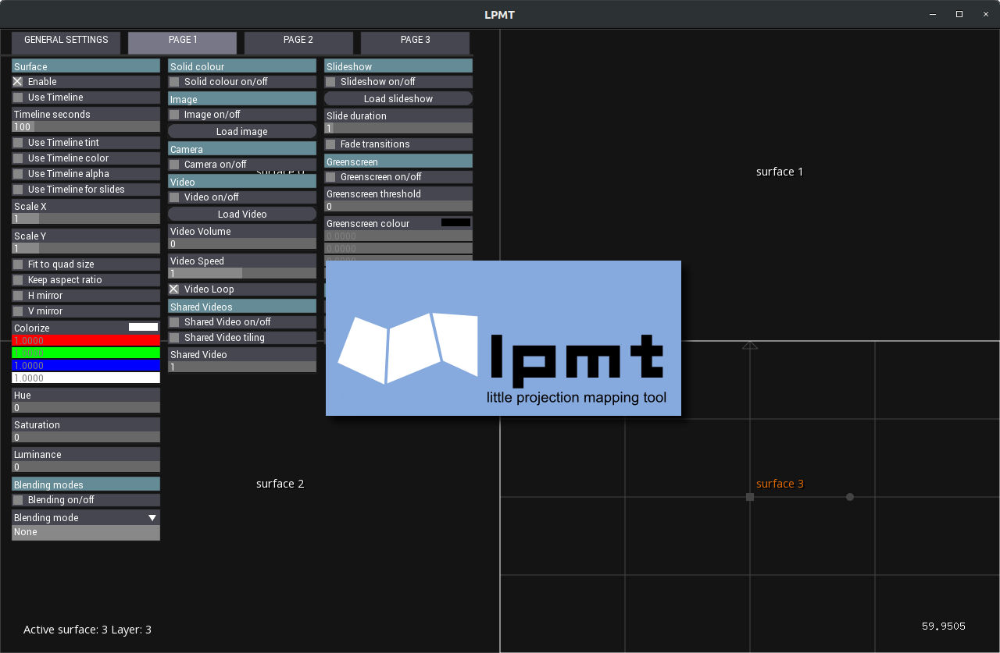
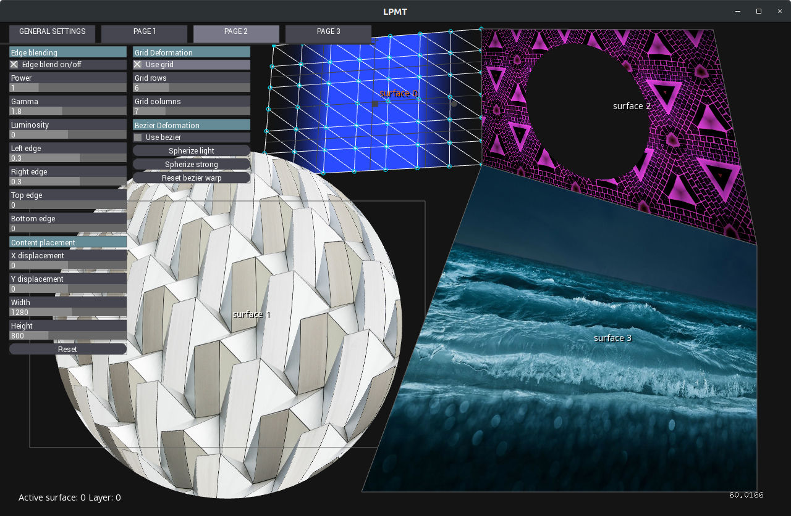
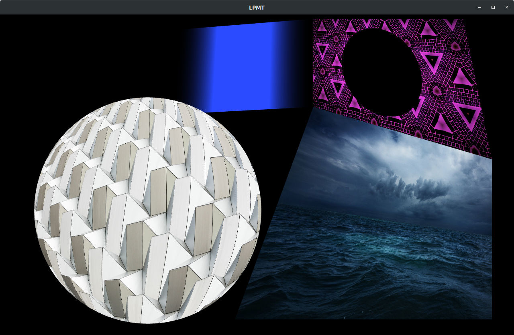

# lpmt
Rewrite of the Little Projection Mapping Tool (http://projection-mapping.org/tools/lpmt/)

This is a fork of LPMT meant to clean up the original codebase and keep the application alive.
The application is built using OpenFrameworks and therefore can be built for Linux/Mac/Windows

The current version has been tested against openFrameworks 0.11.0, so you'll need to install openFrameworks first before you can get this to compile.

The original LPMT code can be found here: https://github.com/hvfrancesco/lpmt

## New Features:
* Improved slideshow functionality (including fades between slides)
* Added option to auto fit content to quads
* Added ability to colorize content as well as control hue/saturation/luminance 
* Fixed quad copying using CTRL-C and CTRL-V
* Added an option to draw outlines around masks in order to smooth the edges
* Added the ability for a surface to receive small images via OSC
* Added the ability to map different parts of a shared video to different quads
* Fixed some bugs in the layer system, so now you can happily add and delete surfaces without issues
* Bezier deformation now renders correctly
* Unified surfaces so that all options works on all surface types, e.g. Greenscreen shader can now be used on any surface
* Lots of small bug fixes and stability improvements

Bug fixes or reports are welcome!

Screenshots of the current version:




## Installation instructions

Install openFrameworks and follow the setup instructions [here](https://openframeworks.cc/download/)

You'll need to add the following addons to your Addons folder:

- https://github.com/danomatika/ofxMidi

e.g.

```
cd openFrameworks/addons
git clone https://github.com/danomatika/ofxMidi
```

All the other addons are either core ones, or are custom versions specific to LPMT that have been integrated into the main code base (e.g. ofxTimeline)

In the openFrameworks 'myApps' folder, clone this repository:

```
cd openFrameworks/apps/myApps
git clone https://github.com/pierrep/lpmt/
```

### Linux
Type ```Make``` or use the provided QtCreator project.


### Windows
Currently built using VS2017 - use the provided project

In order to support audio tracks (not yet supported but may be in the future) you'll need to install:

 - OpenAL SDK http://openal.org/downloads/
 - Libsndfile SDK (http://www.mega-nerd.com/libsndfile/)
 
 The included project points to their default location.
 

